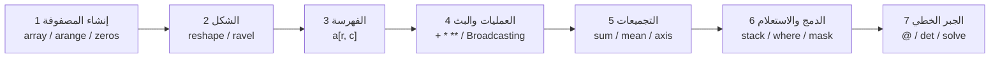

<div dir="rtl">

# محاضرة NumPy: أساسيات الحوسبة العددية في بايثون

> **تقديم:** فريق TriNode · **المستوى:** مبتدئ · **المدة المقترحة:** 90–120 دقيقة (محاضرة + ورشة تطبيقية)
> **الإصدار المُختبَر:** Python 3.12 · NumPy 2.4.4 · **آخر تحديث:** 2026-09-24

---

## مقدمة موجزة عن المحاضرة وهدفها

**NumPy** (اختصار Numerical Python) هي المكتبة الأساسية للحوسبة العددية في بايثون. تقدّم كائن المصفوفة متعددة الأبعاد `ndarray` مع مجموعة واسعة من الدوال الرياضية، وتعمل نواتها بكود C محسَّن، فتجمع مرونة بايثون وسرعة الكود المُترجَم. عليها تقوم مكتبات تحليل البيانات والتعلّم الآلي مثل pandas وscikit-learn وMatplotlib.

**لماذا تهمّ؟** لأن أي عمل جادّ في تحليل البيانات أو الذكاء الاصطناعي أو المحاكاة العلمية يبدأ بمعالجة المصفوفات. إتقان NumPy يعني كتابة كود أقصر وأسرع وأوضح، دون حلقات تكرار يدوية.

**مخرجات التعلّم:** بنهاية المحاضرة يكون الطالب قادرًا على:

1. إنشاء المصفوفات وتغيير أشكالها والوصول إلى عناصرها.
2. تطبيق العمليات المتجهية (Vectorized) وفهم قاعدة البث (Broadcasting).
3. حساب الإحصاءات على مستوى المصفوفة كاملة أو على محور محدد (`axis`).
4. دمج المصفوفات وتصفيتها بالشروط المنطقية.
5. إجراء عمليات المصفوفات والجبر الخطي الأساسية وحل جملة معادلات خطية.

---

## محتوى المحاضرة مقسّم إلى نقاط رئيسية مع توضيح أسئلة/أهداف تعلم لكل نقطة

### 1) إنشاء المصفوفات — `array` · `arange` · `linspace` · `zeros` · `ones`
- **الهدف:** إنشاء مصفوفة من قائمة بايثون، أو من تسلسل رقمي، أو مصفوفة معبّأة مسبقًا.
- **أسئلة موجِّهة:**
  - ما الفرق بين `np.arange(0, 10, 2)` و`np.linspace(0, 10, 2)`؟ (تلميح: `stop` في `arange` مستبعَدة، وفي `linspace` مشمولة، و`num` عدد النقاط لا طول الخطوة.)
  - لماذا تكون قيم `np.zeros((2, 3))` أعدادًا عشرية افتراضيًا؟ وكيف تُمرَّر `shape`؟

### 2) الشكل والبنية — `reshape` · `ravel`
- **الهدف:** إعادة ترتيب البيانات نفسها في شكل جديد، وتسطيحها إلى بُعد واحد.
- **أسئلة موجِّهة:**
  - لماذا يجب أن يبقى عدد العناصر ثابتًا عند `reshape` (مثل 12 = 3 × 4)؟ وماذا يفعل `-1`؟
  - ما الفرق بين `ravel()` (عرض View متى أمكن) و`flatten()` (نسخة دائمًا)؟

### 3) الفهرسة والتقطيع — `a[row, col]` · `a[:, col]` · `a[r1:r2, c1:c2]`
- **الهدف:** الوصول إلى عنصر أو صف أو عمود أو نافذة جزئية من المصفوفة.
- **أسئلة موجِّهة:**
  - ماذا تختار `a[:, 1]`؟ وماذا تختار `a[0:2, 1:3]`؟
  - لماذا تكون نهاية التقطيع مستبعَدة (`start:stop`)؟

### 4) العمليات المتجهية والبث — `+ - * / **` · Broadcasting
- **الهدف:** تنفيذ العمليات على مصفوفة كاملة دون حلقات، وفهم متى يمكن مطابقة شكلين مختلفين.
- **أسئلة موجِّهة:**
  - هل يمكن جمع مصفوفة شكلها `(2, 3)` مع أخرى شكلها `(3,)`؟ ولماذا؟
  - ما شرط التوافق؟ (تكون الأبعاد متساوية، أو يكون أحدها 1.)

### 5) التجميعات — `sum` · `mean` · `std/var` · `min/max` · `argmin/argmax`
- **الهدف:** استخلاص مؤشرات رقمية من المصفوفة كاملة أو على طول محور.
- **أسئلة موجِّهة:**
  - ما الفرق بين `axis=0` (الجمع نزولًا على كل عمود) و`axis=1` (الجمع عبر كل صف)؟
  - لماذا تُعيد `argmax` فهرسًا مسطَّحًا حتى في مصفوفة ثنائية؟ وكيف نحوّله إلى (صف، عمود)؟ (`np.unravel_index`)

### 6) الدمج والاستعلام — `concatenate` · `stack` · `where` · `sort/unique` · القناع المنطقي
- **الهدف:** ضمّ المصفوفات، واختيار القيم بشرط، وترتيبها وحذف تكرارها.
- **أسئلة موجِّهة:**
  - متى تستعمل `stack` بدل `concatenate`؟ (`stack` تضيف بُعدًا جديدًا.)
  - كيف تجمع شرطين في قناع واحد؟ ولماذا نستخدم `&` و`|` وليس `and` و`or`؟

### 7) الرياضيات والجبر الخطي — `*` مقابل `@` · `.T` · `linalg.norm/det/inv/solve`
- **الهدف:** التمييز بين الضرب العنصري وضرب المصفوفات، وحل المعادلات الخطية.
- **أسئلة موجِّهة:**
  - لماذا لا يُعدّ `A * B` ضربَ مصفوفات حقيقيًا؟ وما الأداة الصحيحة؟
  - لماذا يُفضَّل `solve(A, b)` على `inv(A) @ b`؟ وماذا يعني `det(A) = 0`؟

---

## أمثلة بسيطة تطبيقية مع حلولها الخطية خطوة بخطوة

> جميع المخرجات أدناه ناتجة عن تشغيل فعلي على NumPy 2.4.4. في الإصدارات الأقدم قد تظهر الأنواع بصيغة مختلفة (مثل `(2, 0)` بدل `(np.int64(2), np.int64(0))`).

### المثال 1: إنشاء مصفوفة وتغيير شكلها والوصول إلى أجزائها

**المسألة:** أنشئ الأعداد من 1 إلى 12، ثم رتّبها في مصفوفة 3×4، ثم استخرج العنصر 7، والعمود الأول، والنافذة الوسطى.

```python
import numpy as np                 # (1)

a = np.arange(1, 13)               # (2)
m = a.reshape(3, 4)                # (3)
print(m)
print(m.shape, m.ndim)             # (4)

print(m[1, 2])                     # (5)
print(m[:, 0])                     # (6)
print(m[0:2, 1:3])                 # (7)
print(m.reshape(2, -1).shape)      # (8)
print(m.ravel())                   # (9)
```

**المخرجات:**
```text
[[ 1  2  3  4]
 [ 5  6  7  8]
 [ 9 10 11 12]]
(3, 4) 2
7
[1 5 9]
[[2 3]
 [6 7]]
(2, 6)
[ 1  2  3  4  5  6  7  8  9 10 11 12]
```

**الشرح خطوة بخطوة:**
1. نستورد المكتبة باسمها المعتاد `np`.
2. `arange(1, 13)` تنتج 1…12؛ الرقم 13 مستبعَد لأن `stop` حصرية.
3. `reshape(3, 4)` تعيد ترتيب العناصر الـ12 في 3 صفوف و4 أعمدة (3 × 4 = 12).
4. `shape` هي `(3, 4)` و`ndim` هو 2 (بُعدان).
5. `m[1, 2]` هي الصف رقم 1 والعمود رقم 2، والعدّ يبدأ من الصفر، فالناتج 7.
6. `m[:, 0]` النقطتان `:` تعنيان «كل الصفوف»، فنحصل على العمود الأول `[1 5 9]`.
7. `m[0:2, 1:3]` الصفان 0–1 والعمودان 1–2 (النهايتان مستبعَدتان).
8. `-1` تجعل NumPy تحسب البُعد المتبقي بنفسها: 12 ÷ 2 = 6، فالشكل `(2, 6)`.
9. `ravel()` تسطّح المصفوفة إلى بُعد واحد وتعيد عرضًا (View) متى أمكن.

---

### المثال 2: التجميعات على المحاور — درجات الطلاب

**المسألة:** لدينا درجات 4 طلاب في 3 مواد. احسب متوسط كل مادة ومتوسط كل طالب، وأعلى درجة وموضعها، وحدّد الناجحين (متوسط ≥ 75).

```python
import numpy as np

g = np.array([[70, 85, 90],        # (1)
              [60, 75, 80],
              [95, 88, 92],
              [50, 65, 70]])

print(g.shape)                     # (2)
print(g.mean(axis=0))              # (3)
print(g.mean(axis=1).round(2))     # (4)
print(g.max(), g.argmax())         # (5)
print(np.unravel_index(g.argmax(), g.shape))   # (6)

avg = g.mean(axis=1)               # (7)
print(np.where(avg >= 75, "ناجح", "راسب"))     # (8)
```

**المخرجات:**
```text
(4, 3)
[68.75 78.25 83.  ]
[81.67 71.67 91.67 61.67]
95 6
(np.int64(2), np.int64(0))
['ناجح' 'راسب' 'ناجح' 'راسب']
```

**الشرح خطوة بخطوة:**
1. كل صف يمثّل طالبًا وكل عمود مادة؛ نمرّر قائمة قوائم فتصبح المصفوفة ثنائية الأبعاد.
2. الشكل `(4, 3)`: أربعة طلاب وثلاث مواد.
3. `axis=0` تُطوي الصفوف، فنحصل على متوسط **كل عمود** (كل مادة): 68.75 و78.25 و83.
4. `axis=1` تُطوي الأعمدة، فنحصل على متوسط **كل صف** (كل طالب)، ثم نقرّب لرقمين عشريين.
5. أعلى درجة 95، وترتيبها المسطَّح 6 (العدّ بعد تسطيح المصفوفة صفًّا صفًّا).
6. نحوّل الفهرس المسطَّح إلى `(صف، عمود) = (2, 0)`: الطالب الثالث في المادة الأولى.
7. نحفظ متوسطات الطلاب لنعيد استخدامها.
8. `np.where(الشرط، إن_صح، إن_خطأ)` تختار عنصريًّا: الطالبان الأول والثالث ناجحان.

---

### المثال 3: البث (Broadcasting) — طرح متوسط كل عمود

**المسألة:** اطرح متوسط كل مادة من درجات الطلاب (ما يُعرف بتمركز البيانات Centering) دون أي حلقة.

```python
import numpy as np

g = np.array([[70, 85, 90],
              [60, 75, 80],
              [95, 88, 92],
              [50, 65, 70]])

means = g.mean(axis=0)             # (1)
print(g.shape, means.shape)        # (2)

centered = g - means               # (3)
print(centered)
print(centered.mean(axis=0))       # (4)
```

**المخرجات:**
```text
(4, 3) (3,)
[[  1.25   6.75   7.  ]
 [ -8.75  -3.25  -3.  ]
 [ 26.25   9.75   9.  ]
 [-18.75 -13.25 -13.  ]]
[0. 0. 0.]
```

**الشرح خطوة بخطوة:**
1. نحسب متوسط كل عمود، والنتيجة متجه من 3 عناصر.
2. الشكلان `(4, 3)` و`(3,)`. نقارن الأبعاد من اليمين: 3 و3 متساويان، والبُعد الآخر غير موجود في الثاني فيُعامَل كأنه 1، فالتوافق قائم.
3. يُمدَّد المتجه تلقائيًا على كل صف من `g` ثم يُطرح عنصرًا بعنصر، دون نسخ يدوي أو `tile`.
4. تحقّق: متوسط كل عمود بعد التمركز صفر، أي أن العملية صحيحة.

> لو حاولت جمع شكلين مثل `(2, 3)` و`(2,)` لظهر `ValueError` لأن 3 ≠ 2 وليس أيٌّ منهما 1.

---

### المثال 4: القناع المنطقي، و`where`، و`unique`

**المسألة:** في المصفوفة `x = [1, 3, 2, 5, 4, 3]` اختر القيم الأكبر من 2، ثم القيم التي تقع بين 1 و5 (استثناءً)، ثم استبدل الباقي بصفر، ثم عُدّ تكرار كل قيمة.

```python
import numpy as np

x = np.array([1, 3, 2, 5, 4, 3])

mask = x > 2                        # (1)
print(mask)
print(x[mask])                      # (2)
print(x[(x > 1) & (x < 5)])         # (3)
print(np.where(x > 2, x, 0))        # (4)
vals, counts = np.unique(x, return_counts=True)   # (5)
print(vals, counts)
```

**المخرجات:**
```text
[False  True False  True  True  True]
[3 5 4 3]
[3 2 4 3]
[0 3 0 5 4 3]
[1 2 3 4 5] [1 1 2 1 1]
```

**الشرح خطوة بخطوة:**
1. المقارنة `x > 2` تُنتج مصفوفة منطقية بالحجم نفسه (القناع).
2. الفهرسة بالقناع تُبقي المواضع `True` فقط.
3. نجمع شرطين بـ`&` (و) مع **الأقواس الإلزامية** حول كل شرط؛ ولمعنى «أو» نستخدم `|`.
4. `where(x > 2, x, 0)` تُبقي قيمة `x` حيث يتحقق الشرط وتضع 0 في غيره.
5. `unique(..., return_counts=True)` تُرجع القيم الفريدة مرتَّبة مع عدد تكرار كل منها؛ القيمة 3 تكررت مرتين.

---

### المثال 5: الجبر الخطي — حل جملة معادلتين

**المسألة:** حلّ الجملة `2x + y = 3` و`x + 3y = 5`، ثم تحقّق من الحل.

```python
import numpy as np

A = np.array([[2, 1],
              [1, 3]])              # (1)
b = np.array([3, 5])                # (2)

print(round(np.linalg.det(A), 2))   # (3)
x = np.linalg.solve(A, b)           # (4)
print(x)
print(np.allclose(A @ x, b))        # (5)
print(np.linalg.inv(A))             # (6)
print(np.linalg.norm(np.array([3, 4])))   # (7)
```

**المخرجات:**
```text
5.0
[0.8 1.4]
True
[[ 0.6 -0.2]
 [-0.2  0.4]]
5.0
```

**الشرح خطوة بخطوة:**
1. مصفوفة المعاملات `A` (كل صف معادلة).
2. متجه الطرف الأيمن `b`.
3. المحدِّد `det(A) = 2×3 − 1×1 = 5`، وهو لا يساوي صفرًا، فالمصفوفة قابلة للقلب ولدينا حل وحيد. نقرّب لأن الحساب العشري قد يعطي `5.000000000000001`.
4. `solve(A, b)` تحلّ `Ax = b` مباشرة وهي أسرع وأكثر ثباتًا عدديًا من `inv(A) @ b`. الحل: `x = 0.8` و`y = 1.4`.
5. التحقق: `A @ x` (ضرب مصفوفات حقيقي) يجب أن يساوي `b`؛ نستعمل `allclose` لتجاوز فروق التقريب.
6. المعكوس `inv(A)`؛ ضربه في `A` يعطي مصفوفة الوحدة (تقريبًا).
7. المعيار الإقليدي للمتجه `(3, 4)` هو √(3² + 4²) = 5.

---

## تصور بصري بسيط وروابط لأمثلة رسومية جاهزة، مع تعليمات استخدام الصور بشكل احترافي (دقة/أبعاد/تنسيق)

### أ) وصف المخطط المفاهيمي

المخطط التالي يلخّص مسار المحاضرة، وهو **Mermaid** تعرضه GitHub تلقائيًا (لا يحتاج ملف صورة):



وتوضّح الصورة النصية التالية اتجاه المحاور في التجميعات (مصفوفة 3×4):

```text
              axis=1  ──►  (عبر الأعمدة → نتيجة لكل صف)
            ┌────────────────┐
   axis=0   │  1   2   3   4 │   sum(axis=1) → [10, 26, 42]
     │      │  5   6   7   8 │
     ▼      │  9  10  11  12 │
            └────────────────┘
   sum(axis=0) → [15, 18, 21, 24]      المجموع الكلي sum() → 78
```

### ب) صور جاهزة من المستودع الرسمي لـ NumPy

الروابط مثبَّتة على الوسم `v2.3.0` حتى لا تنكسر إذا تغيّر الفرع الرئيسي، وقد جرى التحقق من وجودها وقياس أبعادها.

| # | الموضوع | الرابط | التنسيق | الأبعاد الأصلية |
|---|---------|--------|---------|-----------------|
| 1 | مفهوم البث (Broadcasting) | [broadcasting_1.svg](https://raw.githubusercontent.com/numpy/numpy/v2.3.0/doc/source/user/broadcasting_1.svg) | SVG (متجهي) | ‏137.5 × 50.7 مم (نسبة ≈ 2.7:1) |
| 2 | الفهرسة والتقطيع | [np_matrix_indexing.png](https://raw.githubusercontent.com/numpy/numpy/v2.3.0/doc/source/user/images/np_matrix_indexing.png) | PNG | ‏3278 × 899 بكسل |
| 3 | التجميعات على المحاور | [np_matrix_aggregation.png](https://raw.githubusercontent.com/numpy/numpy/v2.3.0/doc/source/user/images/np_matrix_aggregation.png) | PNG | ‏3278 × 833 بكسل |

**كود التضمين الجاهز (ينسخه الطالب كما هو):**

```html
<p align="center">
  
</p>

<p align="center">
  
</p>
```

### ج) تعليمات الاستخدام الاحترافي للصور

| البند | التوصية |
|-------|---------|
| **التنسيق** | استخدم **SVG** للمخططات والأشكال (تتكيّف مع أي دقة وحجمها صغير)، و**PNG** للّقطات والصور ذات النصوص الدقيقة. تجنّب JPEG للمخططات لأنه يشوّش الحواف والنص. |
| **عرض العرض** | في README اجعل العرض بين **640 و800 بكسل** (عمود المحتوى في GitHub نحو 880 بكسل). حدّده بالسمة `width` ولا تضع `height` كي تبقى النسبة سليمة. |
| **الدقة** | للنسخ التي تحفظها في مشروعك صدِّر PNG بعرض **1600 بكسل** (ضعف عرض العرض) لتبدو حادّة على الشاشات عالية الكثافة. الصور أعلاه بعرض 3278 بكسل أكبر مما يلزم، فقلّصها. |
| **الحجم** | اجعل كل صورة **أقل من 300 كيلوبايت** قدر الإمكان (أدوات: `oxipng` أو `pngquant` أو `svgo`). |
| **الحفظ** | انسخ الصور إلى `assets/images/` بأسماء وصفية بأحرف صغيرة وشرطات (`broadcasting-diagram.svg`)، واستعمل مسارات نسبية كي يعمل المستودع دون اتصال. |
| **النص البديل** | اكتب `alt` وصفيًا بالعربية لكل صورة (إتاحة الوصول لقارئات الشاشة). |
| **الوضع الداكن** | الصور ذات الخلفية الشفافة قد تختفي في الوضع الداكن؛ استعمل خلفية بيضاء أو عنصر `<picture>` بنسختين. |
| **الترخيص** | صور NumPy الرسمية من مستودع مفتوح المصدر؛ راجع ملف `LICENSE.txt` في المستودع، واذكر المصدر عند إعادة استخدامها. |

---

## متطلبات وأدوات الورشة (المتوقع من الطلاب التنفيذ، البيئة التطويرية)، مع خطوات التثبيت والتشغيل

### المتطلبات

- **Python 3.11 أو أحدث** (NumPy 2.4.x يتطلب 3.11 فأعلى؛ الإصدارات الأقدم من NumPy تدعم بايثون الأقدم).
- معرفة أساسية ببايثون: المتغيرات والقوائم والحلقات والدوال.
- محرر أكواد (VS Code أو PyCharm) أو **JupyterLab** للتجريب التفاعلي.
- **Git** لاستنساخ المستودع.

### خطوات التثبيت

```bash
# 1) استنساخ المستودع
git clone https://github.com/<اسم-المستخدم>/numpy-workshop.git
cd numpy-workshop

# 2) إنشاء بيئة افتراضية
python -m venv .venv

# تفعيلها:
source .venv/bin/activate          # Linux / macOS
.venv\Scripts\activate             # Windows (PowerShell / CMD)

# 3) تثبيت الاعتمادات
pip install --upgrade pip
pip install numpy jupyterlab matplotlib
# أو: pip install -r requirements.txt

# 4) التحقق من التثبيت
python -c "import numpy as np; print(np.__version__)"
```

### التشغيل

```bash
# تشغيل مثال محدد
python examples/01_creation_and_indexing.py

# أو العمل تفاعليًا
jupyter lab
```

**محتوى `requirements.txt` المقترح:**
```text
numpy>=2.0
jupyterlab>=4.0
matplotlib>=3.8
```

> **استكشاف الأخطاء:** إذا ظهر `ModuleNotFoundError: No module named 'numpy'` فتأكد أن البيئة الافتراضية مفعَّلة وأن المفسِّر الذي تشغّل به هو نفسه الذي ثبَّتّ فيه المكتبة (`python -m pip install numpy`).

---

## أسئلة شائعة وإجاباتها

<details>
<summary><strong>ما الفرق بين قائمة بايثون ومصفوفة NumPy؟</strong></summary>

المصفوفة تخزّن عناصر من **نوع واحد** في ذاكرة متجاورة وتدعم العمليات المتجهية السريعة. القائمة تقبل أنواعًا مختلطة لكنها أبطأ في الحسابات العددية، وعند إنشاء مصفوفة من قائمة تُحوَّل كل العناصر إلى `dtype` مشترك.
</details>

<details>
<summary><strong>هل <code>A * B</code> هو ضرب المصفوفات؟</strong></summary>

لا. `*` ضرب **عنصر بعنصر** ويتطلب الشكل نفسه (أو شكلين متوافقين للبث). لضرب المصفوفات الحقيقي استخدم `A @ B` أو `np.dot(A, B)`، بشرط أن يساوي عدد أعمدة `A` عدد صفوف `B`.
</details>

<details>
<summary><strong>ماذا يعني <code>axis</code> بالضبط؟</strong></summary>

`axis=0` تُطوي الصفوف فتحصل على نتيجة لكل **عمود**، و`axis=1` تُطوي الأعمدة فتحصل على نتيجة لكل **صف**. من دون `axis` تُحسب الدالة على كل العناصر وتُعاد قيمة واحدة.
</details>

<details>
<summary><strong>هل <code>reshape</code> و<code>ravel</code> ينسخان البيانات؟</strong></summary>

كلاهما يعيد عرضًا (View) على البيانات نفسها متى أمكن، فالتعديل عبره قد ينعكس على الأصل. إذا أردت نسخة مستقلة فاستخدم `.copy()`، أو `flatten()` التي تعيد نسخة دائمًا.
</details>

<details>
<summary><strong>لماذا يحصل <code>std()</code> و<code>var()</code> على قيم تختلف عن حساباتي اليدوية للعيّنة؟</strong></summary>

القيمة الافتراضية `ddof=0` تحسب إحصاءات **المجتمع** (القسمة على n). لحساب تباين العيّنة (القسمة على n − 1) مرّر `ddof=1`، مثل `a.std(ddof=1)`.
</details>

<details>
<summary><strong>ما سبب الخطأ <code>operands could not be broadcast together</code>؟</strong></summary>

الشكلان غير متوافقين مع قاعدة البث: عند مقارنة الأبعاد من اليمين، يجب أن يتساوى كل بُعدين أو يكون أحدهما 1. اطبع `a.shape` و`b.shape` لتحدّد البُعد المتعارض، ثم عدّل الشكل بـ`reshape` أو أضف بُعدًا بـ`b[:, None]`.
</details>

<details>
<summary><strong>متى أستخدم <code>solve</code> ومتى <code>inv</code>؟</strong></summary>

لحل `Ax = b` استخدم `np.linalg.solve(A, b)` فهي أسرع وأدقّ عدديًا. استعمل `inv` فقط عندما تحتاج المعكوس نفسه. وكلاهما يتطلب مصفوفة مربعة غير شاذّة (`det ≠ 0`).
</details>

<details>
<summary><strong>لماذا <code>argmax</code> تعيد رقمًا واحدًا لمصفوفة ثنائية؟</strong></summary>

لأنها تعيد الفهرس بعد تسطيح المصفوفة، ولا تعيد إلا أول تطابق عند التساوي. حوّله إلى (صف، عمود) بـ`np.unravel_index(a.argmax(), a.shape)`، أو مرّر `axis` للحصول على موضع الأقصى لكل صف أو عمود.
</details>

<details>
<summary><strong>لماذا لا أستخدم <code>and</code>/<code>or</code> في القناع المنطقي؟</strong></summary>

لأنها تعمل على قيمة منطقية مفردة وتُظهر خطأ مع المصفوفات. استخدم `&` و`|` و`~` مع وضع كل شرط بين قوسين: `x[(x > 1) & (x < 5)]`.
</details>

---

## مصادر ومراجع مقبولة مع روابطها

**مصادر رسمية (بالإنجليزية):**

| المصدر | الرابط |
|--------|--------|
| موقع NumPy الرسمي — قسم التعلّم (مجموعة مختارة من الدروس) | <https://numpy.org/learn/> |
| NumPy: The Absolute Basics for Beginners | <https://numpy.org/doc/stable/user/absolute_beginners.html> |
| NumPy Quickstart Tutorial | <https://numpy.org/doc/stable/user/quickstart.html> |
| Broadcasting — دليل المستخدم | <https://numpy.org/doc/stable/user/basics.broadcasting.html> |
| مرجع الجبر الخطي `numpy.linalg` | <https://numpy.org/doc/stable/reference/routines.linalg.html> |
| تعليمات التثبيت الرسمية | <https://numpy.org/install/> |
| مستودع NumPy Tutorials (دفاتر Jupyter) | <https://github.com/numpy/numpy-tutorials> |

**مصادر مساندة:**

| المصدر | اللغة | الرابط |
|--------|-------|--------|
| مكتبة NumPy — الخطوة الأولى في علم البيانات (عالم البرمجة) | العربية | <https://3alam.pro/ibr/articles/python-numpy> |
| شرح مكتبة NumPy للمبتدئين — قائمة تشغيل على YouTube (بلهجة مصرية) | العربية | <https://www.youtube.com/playlist?list=PLvsVwFBrUFQoMuwrcmPzMRLROMqDCOaYS> |
| W3Schools — NumPy Tutorial (أمثلة تفاعلية وتمارين) | الإنجليزية | <https://www.w3schools.com/python/numpy/default.asp> |
| GeeksforGeeks — Introduction to NumPy | الإنجليزية | <https://www.geeksforgeeks.org/python/introduction-to-numpy/> |

**المادة الأصلية للمحاضرة:** عرض «NumPy» من إعداد وتقديم **فريق TriNode**.

---

## بنية ملف README مقترحة ومعيارية (مع نموذج تنسيق جاهز)

### أ) بنية المستودع المقترحة

```text
numpy-workshop/
├── README.md                 ← هذا الملف
├── requirements.txt
├── LICENSE
├── assets/
│   └── images/               ← الصور والمخططات
├── examples/
│   ├── 01_creation_and_indexing.py
│   ├── 02_aggregations.py
│   ├── 03_broadcasting.py
│   ├── 04_masking.py
│   └── 05_linear_algebra.py
├── notebooks/
│   └── workshop.ipynb
└── exercises/
    └── README.md             ← التمارين والحلول
```

### ب) قالب Markdown جاهز للنسخ

````markdown
<div dir="rtl">

# عنوان المشروع أو المحاضرة

> جملة واحدة تصف الهدف · **المستوى:** … · **المدة:** … · **آخر تحديث:** YYYY-MM-DD


## فهرس المحتويات
- [مقدمة](#مقدمة)
- [المحتوى](#المحتوى)
- [الأمثلة](#الأمثلة)
- [التصور البصري](#التصور-البصري)
- [التثبيت والتشغيل](#التثبيت-والتشغيل)
- [الأسئلة الشائعة](#الأسئلة-الشائعة)
- [المراجع](#المراجع)
- [المساهمة والترخيص](#المساهمة-والترخيص)

## مقدمة
فقرة قصيرة: ما الموضوع؟ لماذا يهم؟ مخرجات التعلّم في 3–5 نقاط.

## المحتوى
### 1) عنوان النقطة
- **الهدف:** …
- **أسئلة موجِّهة:** …

## الأمثلة
### المثال 1: العنوان
**المسألة:** …
```python
# الكود مع رقم لكل سطر مهم
```
**المخرجات:** …
**الشرح:** 1) … 2) …

## التصور البصري
<p align="center"></p>

## التثبيت والتشغيل
```bash
git clone <repo-url> && cd <repo>
python -m venv .venv && source .venv/bin/activate
pip install -r requirements.txt
```

## الأسئلة الشائعة
<details>
<summary><strong>السؤال؟</strong></summary>

الإجابة.
</details>

## المراجع
- [اسم المصدر](https://example.com)

## المساهمة والترخيص
المساهمات مرحَّب بها عبر Pull Request. الترخيص: MIT (انظر `LICENSE`).

</div>
````

### ج) إرشادات التنسيق لصفحة GitHub

- **الاتجاه من اليمين لليسار:** لُفّ المحتوى كله بـ`<div dir="rtl">` واترك **سطرًا فارغًا** بعد وسم الفتح وقبل وسم الإغلاق كي يُفسَّر Markdown داخله. إذا ظهرت كتل الأكواد بمحاذاة غير مناسبة فهي تبقى مقروءة لأنها باللاتينية.
- **العناوين:** عنوان `#` واحد فقط للمشروع، ثم `##` للأقسام السبعة و`###` للفروع. أبقِ العناوين قصيرة لأن GitHub يبني منها الروابط الداخلية تلقائيًا.
- **الأكواد:** استعمل حاويات مسوَّرة مع تحديد اللغة (`python` و`bash` و`text` و`html`) للحصول على التلوين.
- **المخرجات:** ضعها في كتلة `text` منفصلة عن الكود.
- **الأسئلة الشائعة:** استعمل `<details>` لطيّ الإجابات وتقصير الصفحة.
- **التنبيهات:** استعمل `> **ملاحظة:**` أو صيغة GitHub `> [!NOTE]` و`> [!WARNING]`.
- **المخططات:** فضّل كتل ` ```mermaid ` فهي تُعرض أصلًا في GitHub وتبقى قابلة للتحرير كنص.
- **الروابط:** ثبّت روابط الصور والملفات الخارجية على وسم إصدار (Tag) أو Commit لا على الفرع الرئيسي.
- **الطول:** إذا تجاوز README حوالي 500 سطر فانقل التمارين والتفاصيل إلى `docs/` أو `exercises/` واربطها منه.

</div>
