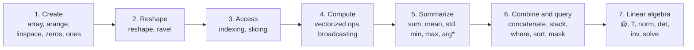
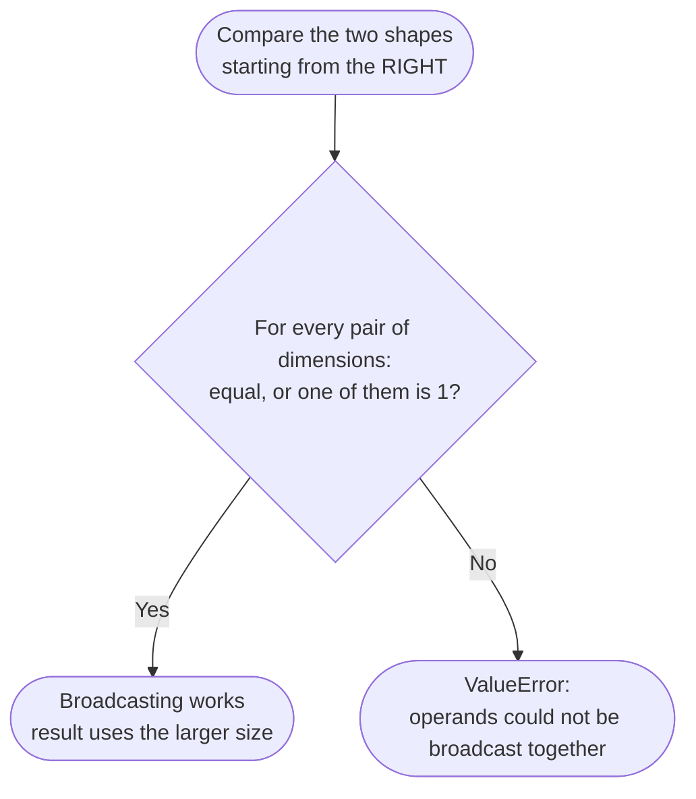

<div align="center">


# NumPy Fundamentals

### A complete, hands-on introduction to numerical computing in Python

*From creating your first array to solving systems of linear equations.*


[Introduction](#1-introduction-and-learning-goals) ·
[Lecture Content](#2-lecture-content-and-learning-objectives) ·
[Examples](#3-worked-examples-with-step-by-step-solutions) ·
[Visuals](#4-visual-illustrations-and-image-guidelines) ·
[Setup](#5-workshop-requirements-and-setup) ·
[FAQ](#6-frequently-asked-questions)

</div>

---

| | |
|---|---|
| **Presented by** | TriNode Team |
| **Level** | Beginner (basic Python required) |
| **Duration** | 90–120 minutes (lecture + hands-on workshop) |
| **Tested with** | Python 3.12 · NumPy 2.4.4 |
| **Last updated** | 2026-09-24 |

## Table of Contents

1. [Introduction and Learning Goals](#1-introduction-and-learning-goals)
2. [Lecture Content and Learning Objectives](#2-lecture-content-and-learning-objectives)
   - [Module 1: Array Creation](#module-1-array-creation)
   - [Module 2: Shape and Structure](#module-2-shape-and-structure)
   - [Module 3: Indexing and Slicing](#module-3-indexing-and-slicing)
   - [Module 4: Vectorized Operations and Broadcasting](#module-4-vectorized-operations-and-broadcasting)
   - [Module 5: Aggregations](#module-5-aggregations)
   - [Module 6: Combining and Querying](#module-6-combining-and-querying)
   - [Module 7: Matrix Math and Linear Algebra](#module-7-matrix-math-and-linear-algebra)
   - [Quick Reference Cheat Sheet](#quick-reference-cheat-sheet)
3. [Worked Examples with Step-by-Step Solutions](#3-worked-examples-with-step-by-step-solutions)
4. [Visual Illustrations and Image Guidelines](#4-visual-illustrations-and-image-guidelines)
5. [Workshop Requirements and Setup](#5-workshop-requirements-and-setup)
6. [Frequently Asked Questions](#6-frequently-asked-questions)
7. [Sources and References](#7-sources-and-references)
8. [README Structure and Ready-to-Use Template](#8-readme-structure-and-ready-to-use-template)

---

## 1. Introduction and Learning Goals

**NumPy** (*Numerical Python*) is the foundation of scientific computing in Python. It provides the `ndarray`, a fast, memory-efficient, N-dimensional array, together with a large library of mathematical functions. Its core is written in optimized C, so you get the flexibility of Python with the speed of compiled code.

Nearly every data-science and machine-learning library (pandas, SciPy, scikit-learn, Matplotlib) is built on NumPy arrays.

**Why it matters**

- **Speed:** vectorized operations replace slow Python loops.
- **Clarity:** one line such as `a * 2 + 1` replaces a whole loop.
- **Ecosystem:** the concepts you learn here (shapes, axes, broadcasting) carry into pandas, PyTorch, TensorFlow, and more.

**Learning outcomes.** By the end of this lecture, you will be able to:

1. Create arrays and reshape them.
2. Access any element, row, column, or sub-block.
3. Apply vectorized operations and explain broadcasting.
4. Compute statistics over a whole array or along an `axis`.
5. Combine, filter, sort, and de-duplicate data.
6. Perform matrix operations and solve linear systems.

**Learning path**



> [!NOTE]
> Every code block in this README was executed on NumPy 2.4.4 and the printed output is the real output. On older NumPy versions, some values print slightly differently (for example `(2, 0)` instead of `(np.int64(2), np.int64(0))`).

---

## 2. Lecture Content and Learning Objectives

All snippets assume:

```python
import numpy as np
```

### Module 1: Array Creation

**Learning objective:** create arrays from Python lists, numeric sequences, or pre-filled placeholders.

**Guiding questions**
1. What is the difference between `np.arange(0, 10, 2)` and `np.linspace(0, 10, 2)`?
2. Why are the values of `np.zeros((2, 3))` floats by default, and how is `shape` passed?

#### `np.array()`: build an array from a Python list

```python
a = np.array([1, 2, 3])                 # 1-D from a list
b = np.array([[1, 2, 3], [4, 5, 6]])    # nested lists -> 2-D
c = np.array([1, 2.5, 3])               # mixed int/float -> one shared dtype

print(a, a.dtype)
print(b, b.shape)
print(c, c.dtype)
```
```text
[1 2 3] int64
[[1 2 3]
 [4 5 6]] (2, 3)
[1.  2.5 3. ] float64
```

- A list becomes a 1-D array; a list of lists becomes 2-D (or higher).
- All elements are cast to **one shared dtype** (above, the integers became floats).

#### `np.arange(start, stop, step)`: like `range()`, but returns an array

```python
print(np.arange(0, 10, 2))      # stop is exclusive
print(np.arange(5, 0, -1))      # negative step counts down
print(np.arange(0, 1, 0.25))    # step can be a float
```
```text
[0 2 4 6 8]
[5 4 3 2 1]
[0.   0.25 0.5  0.75]
```

- `stop` is **exclusive**, exactly like Python's `range()`.
- `step` can be negative or a float.

#### `np.linspace(start, stop, num)`: a fixed number of evenly spaced values

```python
print(np.linspace(0, 1, 5))                       # 5 points, both ends included
print(np.linspace(0, 10, 3))
print(np.linspace(0, 10, 5, endpoint=False))      # exclude the stop value
```
```text
[0.   0.25 0.5  0.75 1.  ]
[ 0.  5. 10.]
[0. 2. 4. 6. 8.]
```

- `start` and `stop` are **both included** by default.
- `num` is *how many points* you get, **not** the step size. This makes it ideal for smooth plotting ranges.

#### `np.zeros(shape)` and `np.ones(shape)`: pre-filled placeholders

```python
print(np.zeros((2, 3)))          # shape is a tuple: (rows, columns)
print(np.ones((2, 2)))
print(np.zeros(3, dtype=int))    # choose the dtype explicitly
```
```text
[[0. 0. 0.]
 [0. 0. 0.]]
[[1. 1.]
 [1. 1.]]
[0 0 0]
```

- `shape` is passed as a **tuple**.
- Values are floats (`0.` and `1.`) unless you pass `dtype`.

---

### Module 2: Shape and Structure

**Learning objective:** rearrange the same data into a new shape, and flatten it back to 1-D.

**Guiding questions**
1. Why must the total number of elements stay the same when reshaping (12 = 3 × 4)? What does `-1` do?
2. What is the difference between `ravel()` (a view when possible) and `flatten()` (always a copy)?

<p align="center">
  
</p>

#### `a.reshape(new_shape)`

```python
a = np.arange(12)
r = a.reshape(3, 4)
print(r)
print(a.reshape(2, -1).shape, a.reshape(-1, 3).shape)   # -1 = "work it out for me"

r[0, 0] = 99                       # r is a view of a ...
print(a[0], np.shares_memory(a, r))   # ... so a changed too
```
```text
[[ 0  1  2  3]
 [ 4  5  6  7]
 [ 8  9 10 11]]
(2, 6) (4, 3)
99 True
```

- The total element count must stay the same (12 = 3 × 4).
- It returns a **view** when possible, so no data is copied and changes propagate.
- Pass `-1` for one dimension and NumPy computes it.

#### `a.ravel()` and `a.flatten()`

```python
a = np.arange(12)
r = a.reshape(3, 4)

print(r.ravel())              # flat 1-D view (no copy when possible)
f = r.flatten()               # flat 1-D copy (always)
f[0] = -1
print(r[0, 0], f[0])          # original untouched
```
```text
[ 0  1  2  3  4  5  6  7  8  9 10 11]
0 -1
```

> [!TIP]
> Use `ravel()` for speed. Use `flatten()` (or `.copy()`) when you plan to modify the result without touching the original.

---

### Module 3: Indexing and Slicing

**Learning objective:** access a single element, a whole row or column, or a rectangular sub-block.

**Guiding questions**
1. What do `a[:, 1]` and `a[0:2, 1:3]` select?
2. Why is the end of a slice excluded (`start:stop`)?

<p align="center">
  
</p>

```python
m = np.arange(1, 13).reshape(3, 4)     # [[ 1  2  3  4]
                                       #  [ 5  6  7  8]
                                       #  [ 9 10 11 12]]
print(m[1, 2])        # single element: row 1, column 2
print(m[:, 1])        # entire column 1
print(m[1, :])        # entire row 1
print(m[0:2, 1:3])    # sub-block: rows 0-1, columns 1-2
print(m[-1, -1])      # negative index: last row, last column
print(m[:, ::2])      # every 2nd column
```
```text
7
[ 2  6 10]
[5 6 7 8]
[[2 3]
 [6 7]]
12
[[ 1  3]
 [ 5  7]
 [ 9 11]]
```

| Syntax | Meaning |
|---|---|
| `a[row, col]` | One element |
| `a[:, col]` | The whole column |
| `a[row, :]` | The whole row |
| `a[r1:r2, c1:c2]` | A sub-block (`r2` and `c2` excluded) |

> [!WARNING]
> Slices are **views**, not copies. Modifying a slice modifies the original array. Use `.copy()` if you need independence.

---

### Module 4: Vectorized Operations and Broadcasting

**Learning objective:** apply operations to whole arrays without loops, and predict when arrays of different shapes are compatible.

**Guiding questions**
1. Can an array of shape `(2, 3)` be added to one of shape `(3,)`? Why?
2. What is the compatibility rule? (Each pair of dimensions must be equal, or one of them must be 1.)

#### Vectorized operations

```python
a = np.array([1, 2, 3])
b = np.array([10, 20, 30])

print(a + b)     # elementwise sum
print(a * b)     # elementwise product
print(a ** 2)    # elementwise power
print(b / a)     # elementwise division
print(a > 1)     # comparisons work too -> boolean array
```
```text
[11 22 33]
[10 40 90]
[1 4 9]
[10. 10. 10.]
[False  True  True]
```

- Arithmetic (`+ - * / **`) and comparisons are applied **elementwise, automatically**.
- It is far faster than looping over elements in plain Python.

#### Broadcasting

<p align="center">
  
</p>

```python
m   = np.array([[1, 2, 3],
                [4, 5, 6]])            # shape (2, 3)
v   = np.array([10, 20, 30])           # shape (3,)
col = np.array([[10], [20]])           # shape (2, 1)

print(m + v)       # v is stretched across every row
print(m + col)     # col is stretched across every column
print(m * 2)       # a scalar is the simplest case
```
```text
[[11 22 33]
 [14 25 36]]
[[11 12 13]
 [24 25 26]]
[[ 2  4  6]
 [ 8 10 12]]
```

**The rule:** compare shapes from the **rightmost** dimension to the left. Two dimensions are compatible if they are **equal** or **one of them is 1**. Otherwise NumPy raises a `ValueError`.



---

### Module 5: Aggregations

**Learning objective:** reduce an array to summary numbers, either over everything or along one axis.

**Guiding questions**
1. What is the difference between `axis=0` (sum down each column) and `axis=1` (sum across each row)?
2. Why does `argmax` return a flat index even for a 2-D array, and how do you convert it to `(row, col)`?

<p align="center">
  
</p>

**Understanding `axis`** (for a 3×4 array):

```text
              axis=1  ──►   (collapses columns: one result per ROW)
            ┌─────────────────┐
   axis=0   │  1   2   3   4  │   sum(axis=1) -> [10, 26, 42]
     │      │  5   6   7   8  │
     ▼      │  9  10  11  12  │
            └─────────────────┘
   sum(axis=0) -> [15, 18, 21, 24]         sum() -> 78
   (collapses rows: one result per COLUMN)
```

#### `sum()`

```python
a = np.array([[1, 2, 3],
              [4, 5, 6]])

print(a.sum())          # every element -> one number
print(a.sum(axis=0))    # down each column
print(a.sum(axis=1))    # across each row
```
```text
21
[5 7 9]
[ 6 15]
```

#### `mean()`

```python
print(a.mean(), a.mean(axis=0), a.mean(axis=1))
print(a.sum() / a.size)            # identical to mean()
```
```text
3.5 [2.5 3.5 4.5] [2. 5.]
3.5
```

> The mean is **sensitive to outliers**, unlike the median.

#### `std()` and `var()`

```python
x = np.array([2, 4, 4, 4, 5, 5, 7, 9])

print(x.var())               # average squared deviation from the mean
print(x.std())               # square root of the variance (same units as data)
print(x.std(ddof=1).round(4))  # sample standard deviation
```
```text
4.0
2.0
2.1381
```

- Both default to **population** statistics (`ddof=0`). Use `ddof=1` for a sample.

#### `min()` and `max()`

```python
print(a.min(), a.max())
print(a.min(axis=1), a.max(axis=0))

# np.minimum / np.maximum compare two arrays elementwise
print(np.minimum(np.array([1, 5, 3]), np.array([4, 2, 6])))
```
```text
1 6
[1 4] [4 5 6]
[1 2 3]
```

#### `argmin()` and `argmax()`

```python
z = np.array([[7, 3, 9],
              [4, 8, 1]])

print(np.argmin(z), np.argmax(z))               # flat indices
print(np.unravel_index(z.argmax(), z.shape))    # back to (row, col)
print(np.array([3, 7, 7, 1]).argmax())          # tie -> first match only
```
```text
5 2
(np.int64(0), np.int64(2))
1
```

---

### Module 6: Combining and Querying

**Learning objective:** join arrays, choose values by condition, order and de-duplicate data, and filter with boolean masks.

**Guiding questions**
1. When should you use `stack` instead of `concatenate`? (`stack` creates a **new** axis.)
2. How do you combine two conditions in one mask, and why `&` / `|` rather than `and` / `or`?

#### `np.concatenate()`: join along an *existing* axis

```python
a = np.array([[1, 2],
              [3, 4]])
b = np.array([[5, 6]])

print(np.concatenate([a, b]))                # axis=0 (default): stack rows
print(np.concatenate([a, b.T], axis=1))      # axis=1: add a column
```
```text
[[1 2]
 [3 4]
 [5 6]]
[[1 2 5]
 [3 4 6]]
```

- Shapes must match **except along the join axis**. The result keeps the same number of dimensions.

#### `np.stack()`: join along a *brand-new* axis

```python
p = np.array([1, 2, 3])
q = np.array([4, 5, 6])

print(np.stack([p, q]))                 # new axis at position 0 -> shape (2, 3)
print(np.stack([p, q], axis=1))         # new axis at position 1 -> shape (3, 2)
```
```text
[[1 2 3]
 [4 5 6]]
[[1 4]
 [2 5]
 [3 6]]
```

- All inputs must have the **exact same shape**. The result has **one more dimension**.

#### `np.where()`: choose values elementwise by a condition

```python
x = np.array([1, -2, 3, -4, 5])

print(np.where(x > 0, x, 0))     # keep x where True, else 0
print(np.where(x > 0)[0])        # with only a condition -> matching indices
```
```text
[1 0 3 0 5]
[0 2 4]
```

#### `np.sort()` and `np.unique()`

```python
x = np.array([3, 1, 2, 3, 1, 5])

print(np.sort(x), x)                       # np.sort returns a NEW array
print(np.unique(x))                        # sorted, duplicates removed
print(np.unique(x, return_counts=True))    # also count each value
```
```text
[1 1 2 3 3 5] [3 1 2 3 1 5]
[1 2 3 5]
(array([1, 2, 3, 5]), array([2, 1, 2, 1]))
```

- `x.sort()` sorts **in place**; `np.sort(x)` returns a new sorted array.

#### Boolean masking

```python
x = np.array([1, 3, 2, 5, 4, 3])

mask = x > 2
print(mask)
print(x[mask])                     # keep only the True positions
print(x[(x > 1) & (x < 5)])        # AND  (parentheses are required)
print(x[(x < 2) | (x > 4)])        # OR
print(x[~mask])                    # NOT
```
```text
[False  True False  True  True  True]
[3 5 4 3]
[3 2 4 3]
[1 5]
[1 2]
```

---

### Module 7: Matrix Math and Linear Algebra

**Learning objective:** distinguish elementwise multiplication from matrix multiplication, and use `numpy.linalg` to measure, invert, and solve.

**Guiding questions**
1. Why is `A * B` **not** true matrix multiplication? What is the correct operator?
2. Why is `solve(A, b)` preferred over `inv(A) @ b`? What does `det(A) = 0` mean?

#### Addition, elementwise product, and matrix product

```python
A = np.array([[1, 2],
              [3, 4]])
B = np.array([[0, 1],
              [1, 0]])

print(A + B)          # elementwise
print(A * B)          # elementwise product (NOT matrix multiplication)
print(A @ B)          # true matrix multiplication
print(np.dot(A, B))   # same result as A @ B
```
```text
[[1 3]
 [4 4]]
[[0 2]
 [3 0]]
[[2 1]
 [4 3]]
[[2 1]
 [4 3]]
```

- `+` and `*` need the **same shape** and work position by position.
- For `A @ B`, the number of columns of `A` must equal the number of rows of `B`. Each output cell is a **row · column** dot product.

#### Transpose

```python
M = np.array([[1, 2, 3],
              [4, 5, 6]])

print(A.T)
print(M.shape, M.T.shape)
```
```text
[[1 3]
 [2 4]]
(2, 3) (3, 2)
```

- Rows become columns and columns become rows. It returns a **view**. It is often needed to align shapes before a matrix product.

#### `np.linalg.norm()`: the length of a vector

```python
v = np.array([3, 4])
print(np.linalg.norm(v))            # Euclidean (L2): sqrt(3^2 + 4^2)
print(np.linalg.norm(v, ord=1))     # L1: sum of absolute values
```
```text
5.0
7.0
```

#### `np.linalg.det()`: the determinant

```python
print(np.linalg.det(A).round(2))                       # 1*4 - 2*3 = -2
print(np.linalg.det(np.array([[1, 2], [2, 4]])))       # singular matrix
```
```text
-2.0
0.0
```

- Defined only for **square** matrices. `det = 0` means the matrix is **singular** (not invertible).

#### `np.linalg.inv()`: the inverse

```python
Ainv = np.linalg.inv(A)
print(Ainv)
print((A @ Ainv).round(10))         # identity matrix
```
```text
[[-2.   1. ]
 [ 1.5 -0.5]]
[[1. 0.]
 [0. 1.]]
```

- `A @ inv(A)` gives the **identity matrix**. It exists only when `det(A) ≠ 0`.

#### `np.linalg.solve()`: solve `Ax = b`

```python
# 2x +  y = 3
#  x + 3y = 5
A = np.array([[2, 1],
              [1, 3]])
b = np.array([3, 5])

print(np.linalg.solve(A, b))
```
```text
[0.8 1.4]
```

- Solves for `x` directly. **Faster and more numerically stable** than `inv(A) @ b`.

---

### Quick Reference Cheat Sheet

| Task | Code | Notes |
|---|---|---|
| Array from list | `np.array([1, 2, 3])` | One shared dtype |
| Range with step | `np.arange(0, 10, 2)` | `stop` excluded |
| N evenly spaced points | `np.linspace(0, 1, 5)` | `stop` included |
| Zeros / ones | `np.zeros((2, 3))`, `np.ones((2, 2))` | Shape is a tuple |
| Reshape | `a.reshape(3, 4)`, `a.reshape(2, -1)` | Same element count |
| Flatten | `a.ravel()` / `a.flatten()` | View / copy |
| Element / row / column | `a[i, j]`, `a[i, :]`, `a[:, j]` | Zero-based |
| Sub-block | `a[r1:r2, c1:c2]` | End excluded |
| Elementwise math | `a + b`, `a * b`, `a ** 2` | Broadcasting applies |
| Sum / mean | `a.sum(axis=0)`, `a.mean(axis=1)` | `axis=0` per column |
| Spread | `a.std()`, `a.var()` | `ddof=1` for a sample |
| Extremes | `a.min()`, `a.max()` | Accept `axis` |
| Positions of extremes | `a.argmin()`, `a.argmax()` | Flat index, first match |
| Join (existing axis) | `np.concatenate([a, b], axis=0)` | Shapes match except the axis |
| Join (new axis) | `np.stack([a, b], axis=0)` | Identical shapes |
| Conditional pick | `np.where(cond, x, y)` | Elementwise |
| Sort / unique | `np.sort(x)`, `np.unique(x, return_counts=True)` | Both return sorted results |
| Filter | `x[x > 2]`, `x[(x > 1) & (x < 5)]` | `&` and, `\|` or, `~` not |
| Matrix product | `A @ B` | Not `A * B` |
| Transpose | `A.T` | A view |
| Length of vector | `np.linalg.norm(v)` | L2 by default |
| Determinant / inverse | `np.linalg.det(A)`, `np.linalg.inv(A)` | Square matrices only |
| Solve `Ax = b` | `np.linalg.solve(A, b)` | Preferred over `inv(A) @ b` |

---

## 3. Worked Examples with Step-by-Step Solutions

### Example 1: Create, reshape, and slice

**Problem:** create the numbers 1–12, arrange them as a 3×4 matrix, then extract the element `7`, the first column, and the middle block.

```python
import numpy as np                 # (1)

a = np.arange(1, 13)               # (2)
m = a.reshape(3, 4)                # (3)
print(m)
print(m.shape, m.ndim)             # (4)

print(m[1, 2])                     # (5)
print(m[:, 0])                     # (6)
print(m[0:2, 1:3])                 # (7)
print(m.reshape(2, -1).shape)      # (8)
print(m.ravel())                   # (9)
```
```text
[[ 1  2  3  4]
 [ 5  6  7  8]
 [ 9 10 11 12]]
(3, 4) 2
7
[1 5 9]
[[2 3]
 [6 7]]
(2, 6)
[ 1  2  3  4  5  6  7  8  9 10 11 12]
```

**Solution, step by step**

| Step | Explanation |
|---|---|
| (1) | Import NumPy under its conventional alias `np`. |
| (2) | `arange(1, 13)` produces 1 to 12; `13` is excluded because `stop` is exclusive. |
| (3) | `reshape(3, 4)` rearranges the 12 elements into 3 rows × 4 columns (3 × 4 = 12). |
| (4) | `shape` is `(3, 4)` and `ndim` is `2` (two dimensions). |
| (5) | `m[1, 2]` is row 1, column 2. Counting starts at 0, so the value is `7`. |
| (6) | `m[:, 0]`: the colon means "all rows", so we get the first column. |
| (7) | `m[0:2, 1:3]`: rows 0–1 and columns 1–2 (end indices excluded). |
| (8) | `-1` lets NumPy compute the missing dimension: 12 ÷ 2 = 6, so `(2, 6)`. |
| (9) | `ravel()` flattens back to 1-D and returns a view when possible. |

---

### Example 2: Aggregations by axis (student grades)

**Problem:** four students took three subjects. Find the average of each subject, the average of each student, the highest score and its position, and who passed (average ≥ 75).

```python
import numpy as np

g = np.array([[70, 85, 90],        # (1)
              [60, 75, 80],
              [95, 88, 92],
              [50, 65, 70]])

print(g.shape)                     # (2)
print(g.mean(axis=0))              # (3)
print(g.mean(axis=1).round(2))     # (4)
print(g.max(), g.argmax())         # (5)
print(np.unravel_index(g.argmax(), g.shape))   # (6)

avg = g.mean(axis=1)               # (7)
print(np.where(avg >= 75, "Pass", "Fail"))     # (8)
```
```text
(4, 3)
[68.75 78.25 83.  ]
[81.67 71.67 91.67 61.67]
95 6
(np.int64(2), np.int64(0))
['Pass' 'Fail' 'Pass' 'Fail']
```

**Solution, step by step**

| Step | Explanation |
|---|---|
| (1) | Each row is a student and each column is a subject. A list of lists becomes a 2-D array. |
| (2) | Shape `(4, 3)`: four students, three subjects. |
| (3) | `axis=0` collapses the rows, giving the mean of **each column** (each subject). |
| (4) | `axis=1` collapses the columns, giving the mean of **each row** (each student), rounded to 2 decimals. |
| (5) | The highest score is `95`, at flat position `6` (counting row by row after flattening). |
| (6) | `unravel_index` converts flat index 6 to `(row 2, column 0)`: the third student, first subject. |
| (7) | Store the per-student averages for reuse. |
| (8) | `np.where(condition, if_true, if_false)` decides elementwise: students 1 and 3 passed. |

---

### Example 3: Broadcasting (center each column)

**Problem:** subtract each subject's average from the grades (this is called *centering*) with **no loop**.

```python
import numpy as np

g = np.array([[70, 85, 90],
              [60, 75, 80],
              [95, 88, 92],
              [50, 65, 70]])

means = g.mean(axis=0)             # (1)
print(g.shape, means.shape)        # (2)

centered = g - means               # (3)
print(centered)
print(centered.mean(axis=0))       # (4)
```
```text
(4, 3) (3,)
[[  1.25   6.75   7.  ]
 [ -8.75  -3.25  -3.  ]
 [ 26.25   9.75   9.  ]
 [-18.75 -13.25 -13.  ]]
[0. 0. 0.]
```

**Solution, step by step**

| Step | Explanation |
|---|---|
| (1) | Compute the mean of every column; the result is a vector of 3 values. |
| (2) | Shapes are `(4, 3)` and `(3,)`. Comparing from the right: `3` and `3` are equal; the second array has no more dimensions, so it is treated as having size 1. They are compatible. |
| (3) | NumPy stretches the vector across every row of `g` automatically, then subtracts elementwise. No `tile`, no loop. |
| (4) | Sanity check: after centering, each column's mean is `0`. |

> [!NOTE]
> Adding shapes `(2, 3)` and `(2,)` would fail: comparing from the right, `3 ≠ 2` and neither is `1`, so NumPy raises a `ValueError`.

---

### Example 4: Boolean masks, `where`, and `unique`

**Problem:** for `x = [1, 3, 2, 5, 4, 3]`, select values greater than 2, then values strictly between 1 and 5, replace the rest with 0, and count how often each value appears.

```python
import numpy as np

x = np.array([1, 3, 2, 5, 4, 3])

mask = x > 2                        # (1)
print(mask)
print(x[mask])                      # (2)
print(x[(x > 1) & (x < 5)])         # (3)
print(np.where(x > 2, x, 0))        # (4)
vals, counts = np.unique(x, return_counts=True)   # (5)
print(vals, counts)
```
```text
[False  True False  True  True  True]
[3 5 4 3]
[3 2 4 3]
[0 3 0 5 4 3]
[1 2 3 4 5] [1 1 2 1 1]
```

**Solution, step by step**

| Step | Explanation |
|---|---|
| (1) | The comparison `x > 2` produces a boolean array of the same shape (the **mask**). |
| (2) | Indexing with the mask keeps only the `True` positions. |
| (3) | Combine conditions with `&` (and) and put **each condition in parentheses**. Use `\|` for "or". |
| (4) | `where(x > 2, x, 0)` keeps `x` where the condition holds and uses `0` elsewhere. |
| (5) | `unique(..., return_counts=True)` returns the sorted unique values and how often each occurs; `3` appears twice. |

---

### Example 5: Linear algebra (solve a 2×2 system)

**Problem:** solve `2x + y = 3` and `x + 3y = 5`, then verify the solution.

```python
import numpy as np

A = np.array([[2, 1],
              [1, 3]])              # (1)
b = np.array([3, 5])                # (2)

print(round(np.linalg.det(A), 2))   # (3)
x = np.linalg.solve(A, b)           # (4)
print(x)
print(np.allclose(A @ x, b))        # (5)
print(np.linalg.inv(A))             # (6)
print(np.linalg.norm(np.array([3, 4])))   # (7)
```
```text
5.0
[0.8 1.4]
True
[[ 0.6 -0.2]
 [-0.2  0.4]]
5.0
```

**Solution, step by step**

| Step | Explanation |
|---|---|
| (1) | The coefficient matrix `A` (each row is one equation). |
| (2) | The right-hand-side vector `b`. |
| (3) | `det(A) = 2·3 − 1·1 = 5 ≠ 0`, so `A` is invertible and the solution is unique. We round because floating point can print `5.000000000000001`. |
| (4) | `solve(A, b)` solves `Ax = b` directly. Result: `x = 0.8`, `y = 1.4`. |
| (5) | Verify with a real matrix product: `A @ x` must equal `b`. `allclose` tolerates tiny rounding errors. |
| (6) | The inverse `inv(A)`. Multiplying it by `A` gives the identity matrix. |
| (7) | The Euclidean norm of `(3, 4)` is `√(3² + 4²) = 5`. |

---

### Practice Exercises

Try each one before opening the solution.

**Exercise 1.** Create the numbers 1 to 20, reshape them into a `(4, 5)` matrix, and compute the sum of each row.

<details>
<summary>Show solution</summary>

```python
n = np.arange(1, 21).reshape(4, 5)
print(n.sum(axis=1))
```
```text
[15 40 65 90]
```
`axis=1` collapses the columns, giving one total per row.
</details>

**Exercise 2.** Given `t = [22, 25, 19, 30, 28, 17]`, print the mean and every temperature above the mean.

<details>
<summary>Show solution</summary>

```python
t = np.array([22, 25, 19, 30, 28, 17])
print(t.mean().round(2), t[t > t.mean()])
```
```text
23.5 [25 30 28]
```
A boolean mask built from `t > t.mean()` filters the array.
</details>

**Exercise 3.** Standardize each column of the grades matrix (z-score): subtract the column mean and divide by the column standard deviation. Verify that every column then has mean 0 and std 1.

<details>
<summary>Show solution</summary>

```python
g = np.array([[70, 85, 90], [60, 75, 80], [95, 88, 92], [50, 65, 70]])
z = (g - g.mean(axis=0)) / g.std(axis=0)

print(z.round(2))
print(np.allclose(z.mean(axis=0), 0), z.std(axis=0).round(6))
```
```text
[[ 0.07  0.75  0.8 ]
 [-0.52 -0.36 -0.34]
 [ 1.57  1.08  1.03]
 [-1.12 -1.47 -1.48]]
True [1. 1. 1.]
```
Two broadcasting operations (subtract, then divide) and no loops.
</details>

**Exercise 4.** Solve `3x + 2y = 12` and `x − y = 1`.

<details>
<summary>Show solution</summary>

```python
A = np.array([[3, 2], [1, -1]])
b = np.array([12, 1])
print(np.linalg.solve(A, b))
```
```text
[2.8 1.8]
```
Check: `3(2.8) + 2(1.8) = 12` and `2.8 − 1.8 = 1`.
</details>

---

## 4. Visual Illustrations and Image Guidelines

### A) Concept diagrams

The learning-path and broadcasting diagrams in [Section 1](#1-introduction-and-learning-goals) and [Module 4](#module-4-vectorized-operations-and-broadcasting) are **Mermaid** blocks. GitHub renders them natively, so they need no image files, stay editable as text, and adapt to light and dark themes.

The axis diagram in [Module 5](#module-5-aggregations) is plain text, so it works in any viewer.

**Shape cheat table:** how the same 2-D data behaves under each operation.

| Operation on shape `(3, 4)` | Result shape | Meaning |
|---|---|---|
| `a.sum()` | scalar | Everything combined |
| `a.sum(axis=0)` | `(4,)` | One value per column |
| `a.sum(axis=1)` | `(3,)` | One value per row |
| `a.T` | `(4, 3)` | Rows and columns swapped |
| `a.reshape(2, 6)` | `(2, 6)` | Same 12 values, new layout |
| `a.ravel()` | `(12,)` | Flattened |

### B) Ready-to-use images (official NumPy repository)

Links are pinned to the `v2.3.0` tag so they will not break if the main branch changes. Each was verified to exist and measured.

| # | Topic | Link | Format | Original size |
|---|---|---|---|---|
| 1 | Broadcasting | [broadcasting_1.svg](https://raw.githubusercontent.com/numpy/numpy/v2.3.0/doc/source/user/broadcasting_1.svg) | SVG (vector) | 137.5 × 50.7 mm (about 2.7 : 1) |
| 2 | Indexing and slicing | [np_matrix_indexing.png](https://raw.githubusercontent.com/numpy/numpy/v2.3.0/doc/source/user/images/np_matrix_indexing.png) | PNG | 3278 × 899 px |
| 3 | Aggregations | [np_matrix_aggregation.png](https://raw.githubusercontent.com/numpy/numpy/v2.3.0/doc/source/user/images/np_matrix_aggregation.png) | PNG | 3278 × 833 px |
| 4 | Reshape (bonus) | [np_reshape.png](https://raw.githubusercontent.com/numpy/numpy/v2.3.0/doc/source/user/images/np_reshape.png) | PNG | 3234 × 1129 px |

**Embed snippet:**

```html
<p align="center">
  
</p>
```

### C) Professional image usage

| Topic | Recommendation |
|---|---|
| **Format** | **SVG** for diagrams and illustrations (sharp at any zoom, tiny files). **PNG** for screenshots and images with fine text. Avoid JPEG for diagrams because it blurs edges and text. |
| **Display width** | **640–800 px** in a README (GitHub's content column is about 880 px). Set `width` and omit `height` so the aspect ratio is preserved. |
| **Resolution** | For images you host yourself, export PNGs at **about 1600 px wide** (2× the display width) so they stay crisp on high-density screens. The originals above (3278 px) are larger than needed, so downscale them. |
| **File size** | Aim for **under 300 KB** per image. Tools: `oxipng` or `pngquant` for PNG, `svgo` for SVG. |
| **Storage** | Copy images into `assets/images/` and reference them with **relative paths**, using lowercase kebab-case names such as `broadcasting-diagram.svg`. |
| **Alt text** | Always write a descriptive `alt` for accessibility and for when images fail to load. |
| **Dark mode** | Transparent images with dark text can vanish on GitHub's dark theme. Use a solid background, or supply two versions through a `<picture>` element with `prefers-color-scheme`. |
| **Licensing** | These images come from the open-source NumPy repository. Check its `LICENSE.txt` and credit the source when you reuse them. |

---

## 5. Workshop Requirements and Setup

### Prerequisites

- **Python 3.11 or newer.** NumPy 2.4.x requires 3.11+; older NumPy releases support older Python versions.
- Basic Python: variables, lists, loops, and functions.
- A code editor (VS Code or PyCharm) or **JupyterLab** for interactive experiments.
- **Git** to clone the repository.

### Installation

```bash
# 1) Clone the repository
git clone https://github.com/<your-username>/numpy-workshop.git
cd numpy-workshop

# 2) Create a virtual environment
python -m venv .venv

# 3) Activate it
source .venv/bin/activate          # Linux / macOS
.venv\Scripts\activate             # Windows (PowerShell / CMD)

# 4) Install dependencies
python -m pip install --upgrade pip
pip install -r requirements.txt

# 5) Verify the installation
python -c "import numpy as np; print(np.__version__)"
```

**`requirements.txt`**

```text
numpy>=2.0
jupyterlab>=4.0
matplotlib>=3.8
```

### Run locally

```bash
# Run a single example script
python examples/01_creation_and_indexing.py

# Or work interactively
jupyter lab
```

### Suggested project layout

```text
numpy-workshop/
├── README.md
├── requirements.txt
├── LICENSE
├── assets/
│   └── images/                       # diagrams and illustrations
├── examples/
│   ├── 01_creation_and_indexing.py
│   ├── 02_aggregations.py
│   ├── 03_broadcasting.py
│   ├── 04_masking.py
│   └── 05_linear_algebra.py
├── notebooks/
│   └── workshop.ipynb
└── exercises/
    └── README.md                     # practice problems and solutions
```

### What students are expected to do

1. Read each module, then **type the code yourself** (do not just copy it).
2. Change the numbers and predict the output before running.
3. Complete the four practice exercises in [Section 3](#practice-exercises).
4. Print `.shape` and `.dtype` whenever a result surprises you.

> [!TIP]
> **Troubleshooting:** if you see `ModuleNotFoundError: No module named 'numpy'`, make sure the virtual environment is activated and that you installed with the same interpreter you run: `python -m pip install numpy`.

---

## 6. Frequently Asked Questions

<details>
<summary><strong>What is the difference between a Python list and a NumPy array?</strong></summary>

<br>

A NumPy array stores elements of **one type** in contiguous memory and supports fast vectorized operations. A list can hold mixed types but is much slower for numeric work. When you build an array from a list, every element is cast to one shared `dtype`.
</details>

<details>
<summary><strong>Is <code>A * B</code> matrix multiplication?</strong></summary>

<br>

No. `*` multiplies **element by element** and needs the same shape (or shapes that broadcast). For true matrix multiplication use `A @ B` or `np.dot(A, B)`, where the number of columns of `A` equals the number of rows of `B`.
</details>

<details>
<summary><strong>What exactly does <code>axis</code> mean?</strong></summary>

<br>

`axis=0` collapses the rows, giving one result per **column**. `axis=1` collapses the columns, giving one result per **row**. With no `axis`, the function works over every element and returns a single value.
</details>

<details>
<summary><strong>Do <code>reshape</code>, <code>ravel</code>, and slicing copy the data?</strong></summary>

<br>

They return **views** whenever possible, so modifying the result can change the original. Call `.copy()` for an independent array. `flatten()` always returns a copy.
</details>

<details>
<summary><strong>Why do <code>std()</code> and <code>var()</code> differ from my sample statistics?</strong></summary>

<br>

They default to **population** statistics (`ddof=0`, dividing by n). For a sample (dividing by n − 1) pass `ddof=1`, for example `a.std(ddof=1)`.
</details>

<details>
<summary><strong>What does "operands could not be broadcast together" mean?</strong></summary>

<br>

The two shapes break the broadcasting rule: comparing from the right, some pair of dimensions is neither equal nor 1. Print `a.shape` and `b.shape` to find the clash, then fix it with `reshape`, or add an axis with `b[:, None]`.
</details>

<details>
<summary><strong>When should I use <code>solve</code> and when <code>inv</code>?</strong></summary>

<br>

To solve `Ax = b`, use `np.linalg.solve(A, b)`. It is faster and more numerically stable. Use `inv` only when you actually need the inverse matrix. Both require a square, non-singular matrix (`det ≠ 0`).
</details>

<details>
<summary><strong>Why does <code>argmax</code> return a single number for a 2-D array?</strong></summary>

<br>

It returns the index into the **flattened** array, and only the **first** match if there is a tie. Convert it with `np.unravel_index(a.argmax(), a.shape)`, or pass `axis` to get one position per row or column.
</details>

<details>
<summary><strong>Why can't I use <code>and</code> / <code>or</code> in a boolean mask?</strong></summary>

<br>

Python's `and` / `or` expect a single truth value and raise an error on arrays. Use `&`, `|`, and `~`, and wrap each condition in parentheses: `x[(x > 1) & (x < 5)]`.
</details>

<details>
<summary><strong>Why is <code>arange</code> with float steps sometimes surprising?</strong></summary>

<br>

Floating-point rounding can make the number of elements differ from what you expect. When you care about the exact count, use `np.linspace(start, stop, num)`, which takes the number of points directly.
</details>

---

## 7. Sources and References

**Official documentation**

| Resource | Link |
|---|---|
| NumPy: Learn (curated tutorials and books) | <https://numpy.org/learn/> |
| NumPy: The Absolute Basics for Beginners | <https://numpy.org/doc/stable/user/absolute_beginners.html> |
| NumPy Quickstart Tutorial | <https://numpy.org/doc/stable/user/quickstart.html> |
| Broadcasting (User Guide) | <https://numpy.org/doc/stable/user/basics.broadcasting.html> |
| `numpy.linalg` reference | <https://numpy.org/doc/stable/reference/routines.linalg.html> |
| Installation guide | <https://numpy.org/install/> |
| NumPy Tutorials (Jupyter notebooks) | <https://github.com/numpy/numpy-tutorials> |

**Supplementary learning**

| Resource | Language | Link |
|---|---|---|
| W3Schools: NumPy Tutorial (interactive examples and exercises) | English | <https://www.w3schools.com/python/numpy/default.asp> |
| GeeksforGeeks: Introduction to NumPy | English | <https://www.geeksforgeeks.org/python/introduction-to-numpy/> |
| Aalam Al-Barmaja: NumPy, the first step in data science | Arabic | <https://3alam.pro/ibr/articles/python-numpy> |
| NumPy beginner playlist on YouTube (Egyptian dialect) | Arabic | <https://www.youtube.com/playlist?list=PLvsVwFBrUFQoMuwrcmPzMRLROMqDCOaYS> |

**Original lecture material:** the "NumPy" slide deck prepared and presented by the **TriNode Team**.

<div align="center">

**Presented by TriNode Team** · Built with NumPy

*Found a mistake or have an improvement? Open an issue or a pull request.*

</div>
